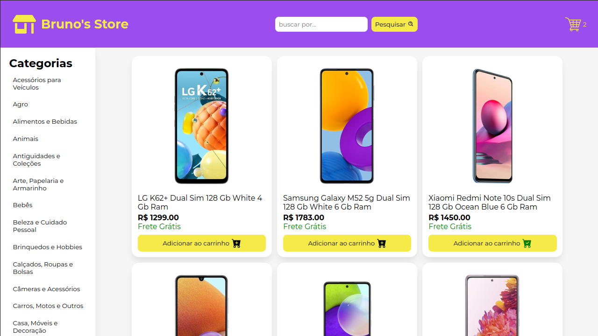
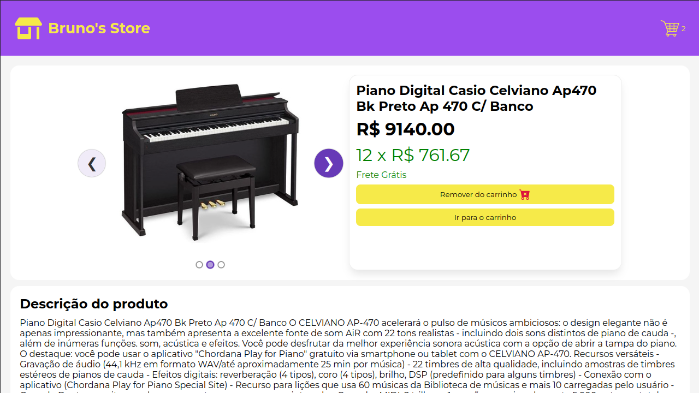
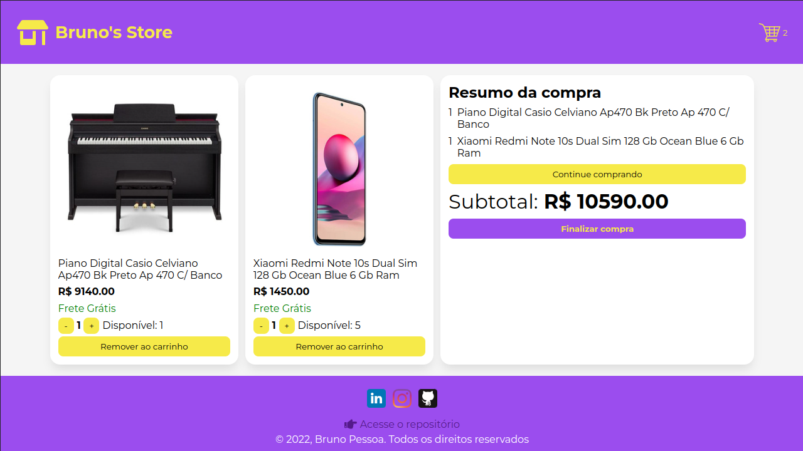

# Projeto Online Store



## Contexto
Este projeto foi desenvolvido com o intuito de consolidar meus estudos de __React__.

Neste projeto pessoal busquei construir uma loja online utilizando a API do mercado livre de modo que o usuário pudesse selecionar categoria de produtos ou buscar por um produto ou marca específicos, visualizando a sua descrição, especificações e detalhes referentes a preços e frete. A aplicação possui quatro páginas distintas, uma na qual se pode fazer buscas e navegar pelos produtos, outra com os detalhes do produto selecionado, uma terceira para visualizar os items do carrinho e um resumo da compra e finalmente uma página de checkout.

[Experimente a aplicação clicando aqui](https://brunofpessoa.github.io/store/)

## Detalhes do desenvolvimento
Toda a aplicação foi construída com __React__ versão 18 com componentes funcionais e gerenciamento dos dados da aplicação é feito através do __Context API__, as informações do carrinho são salvas localmente no navegador para persistir as informações do carrinho de compras entre as sessões. O design foi idealizado por mim e a estilização foi feita sem nenhum framework com a finalidade de praticar CSS.

<details>
<summary>📑 API utilizada</summary>

Todas as informações dos produtos foram obtidas da API do mercado livre pelos seguintes _endpoints_.
  Para as categorias dos produtos:
    Endpoint: `https://api.mercadolibre.com/sites/MLB/categories`

  Para buscar por categoria, produto, marca, etc:
    Endpoint: `https://api.mercadolibre.com/sites/MLB/search?category=$CATEGORY_ID&q=$QUERY`

  Para acessar os detalhes de um produto:
    Endpoint: `https://api.mercadolibre.com/items/${PRODUCT_ID}`

  Para acessar a descrição de um produto:
    `https://api.mercadolibre.com/items/${PRODUCT_ID}/description`
  
  Para mais informações sobre a API consulte a [documentação](https://developers.mercadolivre.com.br/pt_br/itens-e-buscas)

</details>

<details>
<summary>🖼️ Veja algumas imagens</summary>





</details>

## Técnologias utilizadas

> Desenvolvido com: React, CSS3, HTML5, ES6, Fetch API

## Instalação

1. Clone o repositório
  ```sh
    git clone https://github.com/brunofpessoa/store.git
  ```
2. Instale as dependências
  ```bash
  npm install
  ``` 
3. Execute o projeto
  ``` bash
  npm start
  ```
## Contribua com o projeto
Se você tiver uma sugestão para melhorar isso, faça um fork do repositório e faça um _pull request_. Você também pode simplesmente abrir um problema com a tag "enhancement". Não se esqueça de dar uma estrela ao projeto! Obrigado novamente!

1. Faça um Fork do projeto
2. Cria sua Feature Branch (git checkout -b feature/AmazingFeature)
3. Confirme suas alterações (git commit -m 'Add some AmazingFeature')
4. Publique sua branch (git push origin feature/AmazingFeature)
5. Abra o Pull Request

## Contato

Email: `jadsoncerqueira97@gmail.com`

[LinkedIn](https://www.linkedin.com/in/jadsoncerqueira/)

[GitHub](https://github.com/jadsoncerqueira/)
